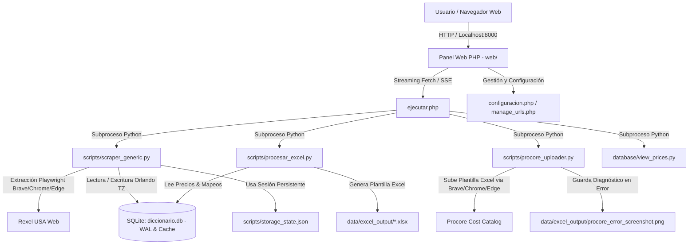

# Catalogo Update Workflow | Brightronix

Sistema web integral de automatización para la extracción, análisis de fluctuación de precios, cálculo de impuestos, generación de plantillas y sincronización directa con el **Catálogo de Costos (Cost Catalog) de Procore**, utilizando datos en tiempo real extraídos de **Rexel USA**.

---

## 🌟 Características Principales

- **Extracción Automatizada Multinivel (Scraper Generic)**:
  - Motor de scraping basado en **Playwright** para la extracción de precios y productos en Rexel USA.
  - Soporte dinámico para múltiples categorías: `EMT`, `PVC`, `Wires`, `FUSES`, y cualquier nueva categoría añadida desde el panel.
  - Histórico de fluctuación: calcula automáticamente la diferencia en dólares (`$ Diferencia`) y el porcentaje de cambio (`% Variación`) entre el precio histórico y el precio actual.

- **Gestión Avanzada de Sesión Rexel (Session Manager)**:
  - Asistente interactivo con detección automática del navegador instalado (`Brave`, `Microsoft Edge`, `Google Chrome`).
  - Almacenamiento y reutilización segura de cookies y tokens de sesión en `scripts/storage_state.json`.
  - Verificación visual de estado de sesión en la interfaz (`🟢 Conectado` / `🔴 Desconectado`) y auto-renovación silenciosa de tokens en segundo plano.

- **Motor Unificado de Navegadores & Optimización Extrema para Servidores**:
  - **Detección Homogénea en Todo el Sistema**: Utiliza de manera consistente el mismo navegador (ej. **Brave**) en todas las operaciones del sistema: extracción en Rexel, subidas a Procore, verificador de credenciales y renovación de sesión.
  - **Modo Headless Ultraligero para Servidores (Ahorro del 75% de RAM)**: Bloqueo selectivo de recursos pesados (imágenes, medios, fuentes y rastreadores de analítica como Criteo/Hotjar/Google Analytics) durante el scraping, reduciendo el consumo de RAM de ~800 MB a menos de ~150 MB por worker y acelerando la navegación 3x.
  - **Compatibilidad con VPS/Linux**: Detección automática de servidores sin entorno gráfico (`DISPLAY`), forzando modo headless y aplicando flags para prevenir colapsos de memoria compartida (`--disable-dev-shm-usage`, `--disable-gpu`, `--no-sandbox`).

- **Estandarización de Zona Horaria Operativa (Orlando, Florida)**:
  - Sincronización estricta en hora de **Orlando, Florida (`America/New_York` / Eastern Time: EST/EDT)** en PHP (`APP_TIMEZONE`) y Python (`ZoneInfo`).
  - Eliminación de desfases por UTC de SQLite, garantizando marcas de tiempo idénticas, cálculos de historial precisos y consistencia total sin importar la ubicación geográfica del servidor.

- **Alto Rendimiento en Base de Datos & Conexiones SQLite**:
  - Índices de cobertura compuestos (`idx_cat_web_ult_act`, `idx_cat_web_cat_ult_act`) que convierten búsquedas secuenciales en operaciones instantáneas en RAM (`SEARCH TABLE USING COVERING INDEX`).
  - Configuración avanzada de pragmas SQLite: `synchronous = NORMAL`, `cache_size = -64000` (64 MB de caché en RAM), `temp_store = MEMORY` y `mmap_size = 256 MB`.
  - Consultas consolidadas en el Dashboard reduciendo la latencia de carga a **~68 ms**.

- **Monitor de Ejecución en Tiempo Real (Live Streaming)**:
  - Streaming unbuffered (`stream_process_output`) que transmite la salida de los scripts Python línea por línea a la interfaz web mediante `fetch` sin recargar la página.
  - Indicador de carga circular con cálculo porcentual dinámico.
  - Barra de métricas en vivo: Enlaces procesados, Productos detectados, Precios actualizados e Ítems no mapeados.
  - Consola de terminal interactiva con auto-scroll y resaltado sintáctico.
  - Modal de resumen ejecutivo y acceso directo al flujo de revisión.

- **Reporte e Información de Precios (Market Intelligence)**:
  - Panel comparativo completo del comportamiento y fluctuación del mercado.
  - Filtros dinámicos en tiempo real por categoría y por comportamiento: `▲ Subieron`, `▼ Bajaron`, `▬ Sin Cambios`.
  - Buscador predictivo en vivo (`table-search`).
  - Cálculo instantáneo de recargo de impuestos (**Tax Rate**) con soporte para **Modo Bypass (0%)**.
  - Exportación consolidada a Excel con formato analítico y formato de fechas americano (MM/DD).

- **Centro de Control y Sincronización Procore (Procore Uploader)**:
  - Macro automatizada para inicio de sesión, navegación e importación en el **Cost Catalog** de Procore.
  - **Navegación Directa por ID de Empresa**: Extrae el Company ID post-login para navegar directamente a `https://app.procore.com/{company_id}/company/cost_catalog`, eliminando fallos por menús desplegables.
  - **Detección Resiliente del Menú de Acciones (Kebab 3 Puntos)**: Localizadores robustos adaptados al DOM React de Procore con soporte para selección automática de importación.
  - **Modo Silencioso (Headless)**: Switch interactivo integrado que permite ejecutar el navegador en segundo plano sin abrir ventanas gráficas, ahorrando recursos de CPU y RAM.
  - **Captura Diagnóstica Automática**: Si ocurre un timeout o error en Procore, se toma automáticamente una captura de pantalla completa (`data/excel_output/procore_error_screenshot.png`) y se visualiza directamente en el monitor web.

- **Diseño de Vanguardia & Experiencia Visual (Dark Matte Executive UI)**:
  - Interfaz moderna en tonos oscuros mate (`#1b212d` / `#242a38`), detalles luminiscentes en coral (`#fb5a3a`), esmeralda (`#10b981`) y ámbar (`#f59e0b`).
  - Tipografía profesional Google Fonts (*Poppins*) con pila de fuentes del sistema como fallback instantáneo.
  - Micro-interacciones hápticas en botones (`transform: scale(0.975)`), prevención de saltos de diseño (CLS) y contraste optimizado bajo estándares WCAG AA.
  - **Page Visibility API**: Detección inteligente de pestañas activas para pausar y reanudar sondeos en segundo plano, ahorrando ciclos de CPU del cliente.

---

## 🏗️ Arquitectura del Sistema



---

## 📁 Estructura del Directorio

```text
Catalogo Update Workflow/
├── css/                                # Hojas de estilo y recursos gráficos
│   ├── style.css                       # Sistema de diseño global (Dark Matte, animaciones, componentes)
│   └── logo-text.png                   # Logotipo corporativo principal
├── data/                               # Archivos de datos y salidas generadas
│   ├── excel_output/                   # Plantillas procesadas para Procore y capturas de diagnóstico
│   └── excel_templates/                # Plantillas maestras de Excel protegidas
├── database/                           # Base de datos SQLite y scripts de consulta
│   ├── database_creator/               # Scripts de inicialización de esquemas
│   ├── diccionario.db                  # Base de datos SQLite principal (WAL, 64MB Cache, Índices)
│   ├── preview_taxes.py                # Generador de vista previa de precios e impuestos
│   └── view_prices.py                  # Generador del reporte de precios y fluctuaciones
├── scripts/                            # Automatizaciones y macros en Python
│   ├── app_config.py                   # Acceso centralizado a configuraciones de base de datos
│   ├── import_dictionary_single.py     # Importación de diccionarios por categoría individual
│   ├── price_history.py                # Historial de precios (mes anterior, último previo y actual en TZ Orlando)
│   ├── procesar_excel.py               # Generador de plantillas Excel para Procore
│   ├── procore_uploader.py             # Automatización de subida directa a Procore (Playwright)
│   ├── refresh_rexel_session.py        # Auto-renovación silenciosa de tokens de Rexel
│   ├── scraper_generic.py              # Scraper principal multilínea con streaming y bloqueo de recursos
│   ├── session_manager.py              # Gestor de sesión interactiva y persistencia OAuth
│   ├── storage_state.json              # Almacén de cookies y tokens de sesión de Rexel USA
│   ├── utils.py                        # Motor unificado de navegadores, zona horaria y utilidades
│   └── verify_procore_login.py         # Validador de credenciales de Procore con motor unificado
├── web/                                # Interfaz de usuario (PHP / Vanilla JS)
│   ├── app-dialogs.js                  # Modales modernos de alerta, confirmación y prompts
│   ├── configuracion.php               # Panel de ajustes, cuentas, impuestos y categorías
│   ├── db.php                          # Conexión PDO SQLite centralizada con pragmas de alto rendimiento
│   ├── ejecutar.php                    # Monitor en vivo, streaming de scrapers y Centro Procore
│   ├── error_classifier.php            # Clasificador de errores y alertas amigables
│   ├── index.php                       # Dashboard principal y lanzador de herramientas
│   ├── manage_urls.php                 # Controlador CRUD de categorías y enlaces
│   ├── modal_rexel_session.php         # Componente modal de conexión y estado de Rexel
│   └── session_manager.php             # Endpoints para el modal de sesión de Rexel
├── requirements.txt                    # Dependencias de Python
└── README.md                           # Documentación técnica del proyecto
```

---

## ⚙️ Instalación y Requisitos

### 1. Requisitos Previos
- **PHP**: Versión 7.4 o superior (con extensiones `pdo_sqlite`, `curl`, `mbstring`).
- **Python**: Versión 3.9 o superior.
- **Navegador**: Microsoft Edge, Google Chrome o Brave instalado.

### 2. Instalación de Dependencias de Python

Se recomienda utilizar un entorno virtual:

```bash
# Crear entorno virtual
python -m venv venv

# Activar entorno virtual
# En Windows (PowerShell):
.\venv\Scripts\Activate.ps1
# En Windows (CMD):
.\venv\Scripts\activate.bat
# En Linux/macOS:
source venv/bin/activate

# Instalar librerías requeridas
pip install -r requirements.txt

# Instalar los navegadores de Playwright
playwright install chromium
```

### 3. Contenido de `requirements.txt`
```text
playwright>=1.40.0
pandas>=2.0.0
openpyxl>=3.1.0
requests>=2.31.0
```

### 4. Ejecución del Servidor Local

Inicia el servidor web de PHP en el puerto 8000:

```bash
php -S localhost:8000
```

Accede desde tu navegador a: **`http://localhost:8000`**

---

## 🚀 Guía de Uso del Workflow

### Paso 1: Configuración Inicial
1. Ingresa a **Configuración** (`configuracion.php`) haciendo clic en el icono de engranaje (`⚙️`) de la barra de navegación.
2. **Conectar Rexel**:
   - Pulsa *"Conectar Cuenta Rexel"*. Se abrirá el asistente interactivo.
   - Selecciona tu navegador preferido (`Brave`, `Edge` o `Chrome`) y pulsa *"Abrir Navegador"*.
   - Inicia sesión normalmente en Rexel USA. El sistema detectará automáticamente el inicio de sesión y guardará las cookies.
3. **Conectar Procore**:
   - Ingresa el correo y la contraseña de tu cuenta de Procore. El sistema validará las credenciales y las guardará de forma segura en la base de datos local.
4. **Configurar Impuestos (Tax Rate)**:
   - Define el porcentaje de impuesto global (ej. `6.5%`). Si deseas calcular precios netos sin recargo, activa el switch **Modo Bypass (0%)**.
5. **Categorías y Enlaces**:
   - Revisa o añade las URLs de búsqueda en Rexel para cada categoría (`EMT`, `PVC`, `Wires`, `FUSES`, etc.).
   - Sube las plantillas base de mapeo de Procore correspondientes a cada categoría.

---

### Paso 2: Ejecución del Scraping
1. En el **Dashboard Principal** (`index.php`), selecciona la categoría que deseas actualizar (ej. *EMT*) o haz clic en *"Actualizar Todos los Catálogos"*.
2. Serás redirigido a la pantalla de **Monitoreo en Vivo** (`ejecutar.php`):
   - Observa en tiempo real el progreso del círculo de carga y la extracción de cada enlace.
   - Revisa los productos detectados, actualizados y no mapeados en la barra de métricas.
   - Al finalizar, se abrirá un modal de resumen con la duración del proceso y las estadísticas finales.
3. Haz clic en **"Continuar a Vista Previa y Taxes"**.

---

### Paso 3: Validación de Precios e Impuestos
1. En la pantalla de **Revisión de Precios** (`preview_tax`):
   - Comprueba la tabla con los costos base extraídos, el impuesto aplicado y el costo final resultante.
   - Revisa las métricas de fluctuación (precios que subieron, bajaron o se mantuvieron).
   - Confirma el impuesto y pulsa **"Generar Archivo Excel para Procore"**.

---

### Paso 4: Sincronización con Procore
1. Tras generar el archivo, o accediendo directamente desde el botón **`🚀 Procore Dashboard`**:
   - Podrás ver las plantillas listas para sincronizar, con la fecha de generación y el tamaño del archivo.
   - **Interruptor de Modo Silencioso (Headless)**:
     - `[✓] ⚡ Modo Silencioso (Headless)` *(Activado por defecto)*: Ejecuta la automatización en segundo plano sin desplegar ventanas externas, con mínimo consumo de memoria y CPU.
     - `[ ] 🖥️ Modo Supervisado`: Desmarca el switch si deseas que se abra la ventana del navegador para inspeccionar visualmente cada acción de la macro.
2. Pulsa **"🚀 Subir a Procore Ahora"**:
   - El monitor web transmitirá cada fase del proceso:
     1. *Autenticación* en Procore.
     2. *Navegación Directa* a la herramienta **Cost Catalog**.
     3. *Apertura del Menú de Importación* (asistente de carga).
     4. *Carga y Validación* del archivo Excel generado.
   - Si Procore presenta algún diálogo inesperado o error, el sistema capturará automáticamente una imagen diagnóstica que podrás revisar directamente en la página web.
3. Al finalizar con éxito, se mostrará el modal de confirmación y podrás descargar o gestionar otras categorías.

---

## 📊 Reporte e Información de Precios

Puedes consultar en cualquier momento el estado integral de la base de datos pulsando en **`📊 Reporte e Información de Precios`**:
- **KPIs Globales**: Total de ítems registrados, total con precio actualizado, promedio de variación porcentual del catálogo.
- **Tarjetas por Categoría**: Resumen individual de ítems y fluctuación promedio para cada catálogo.
- **Filtros Dinámicos**: Permite aislar productos que aumentaron de precio (`▲ Subieron`), disminuyeron (`▼ Bajaron`) o permanecieron estables (`▬ Sin Cambios`).
- **Exportación Completa**: Botón para generar y descargar un consolidado en formato Excel con todas las columnas de análisis comercial.

---

## 🛠️ Base de Datos (`database/diccionario.db`)

La base de datos SQLite contiene las siguientes tablas principales:

| Tabla | Descripción |
|---|---|
| `catalogo_web` | Almacena los productos extraídos de Rexel, precios actuales, `precio_anterior`, URL origen, categoría y marcas de tiempo. |
| `mapeo_procore` | Tabla de correspondencia entre los ítems web de Rexel y las columnas oficiales del Cost Catalog de Procore. |
| `scraping_urls` | Lista de enlaces de búsqueda configurados por categoría y su estado de ejecución (activo/pausado). |
| `app_config` | Almacén clave-valor de configuración global (`procore_email`, `procore_password`, `tax_rate`, `tax_bypass`, etc.). |

---

## 🔒 Seguridad y Buenas Prácticas

- **Protección CSRF**: Todas las peticiones POST y ejecuciones de streaming están protegidas por tokens de sesión CSRF (`$_SESSION['csrf_token']`).
- **Prevención de Path Traversal**: Las rutas de archivos Excel se validan estrictamente contra el directorio canónico permitido (`data/excel_output/`).
- **Aislamiento de Credenciales**: Las contraseñas y cookies sensibles residen localmente en la base de datos SQLite y en `scripts/storage_state.json`, protegidas por exclusiones de control de versiones (`.gitignore`).
- **Escapado Seguro en CLI**: Todos los comandos invocados mediante subprocesos utilizan `escapeshellarg()` para mitigar riesgos de inyección de comandos.

---

## 📝 Licencia

Este proyecto es de uso exclusivo para operaciones internas de Brightronix. Todos los derechos reservados.

---

## Prototipo experimental: Rexel en navegador local

El panel incluye un flujo aislado basado en una extensión Manifest V3 ubicada en `extension/rexel-local-scraper`. La extensión usa una pestaña normal de Rexel y la sesión local del usuario; el servidor recibe únicamente productos y precios validados. No recibe contraseñas, cookies, tokens ni `localStorage` de Rexel y no ejecuta Playwright/Chromium para este flujo.

La guía exacta de instalación, primera prueba, límites y desactivación está en `extension/rexel-local-scraper/README.md`. El flujo anterior permanece disponible.
